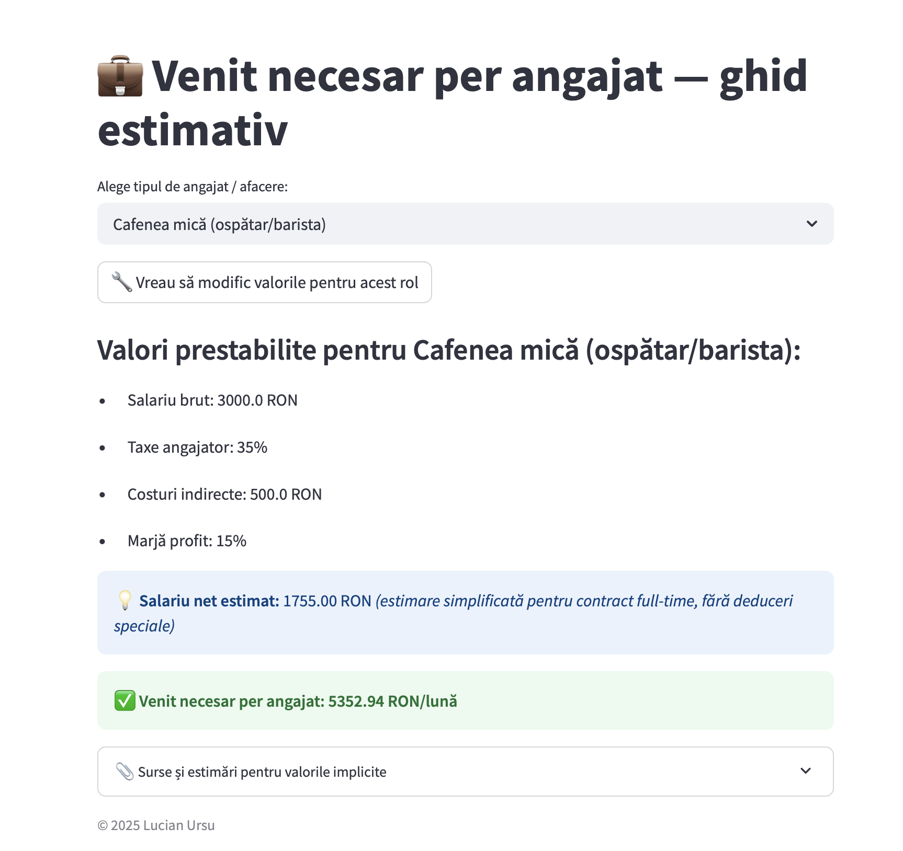

# 💼 Venit necesar per angajat — ghid estimativ

„Venit necesar per angajat” este o unealtă gândită pentru antreprenorii,
managerii și freelancerii din România care vor să înțeleagă mai clar dacă
activitatea lor este sustenabilă.

Ea răspunde direct la o întrebare esențială, dar adesea trecută cu vederea:
> **„Care este venitul minim pe care trebuie să-l producă fiecare angajat pentru
> ca afacerea mea să fie profitabilă?”**

---

## 🔍 Ce poți face cu această unealtă

- Selectezi un scenariu presetat (cafenea, firmă IT, agenție, freelancer)
- Vezi salariul brut, costurile indirecte și marja de profit implicite
- Calculezi salariul net estimativ
- Obții **venitul minim lunar necesar** pentru a fi pe profit
- Poți edita orice valoare și testa diverse scenarii

---

## 🖼️ Interfață



---

## 🧪 Cum o folosești

Aplicația poate fi accesată:
- 💻 Local, folosind `streamlit run`
- ☁️ Sau online, dacă o publici pe [streamlit.io/cloud](https://streamlit.io/cloud)

---

## ⚙️ Instalare locală

1. Clonează proiectul:
```bash
git clone https://github.com/numele-tău/venit-angajat.git
cd venit-angajat
```

2. Instalează proiectul cu `poetry`:
```bash
poetry install
```

3. Rulează aplicația:
```bash
poetry shell
streamlit run app_final_stabil.py
```

---

## 📎 Surse și estimări

Valorile implicite sunt inspirate din:
- [termene.ro](https://termene.ro)
- [eJobs](https://www.ejobs.ro)
- Codul Fiscal (2024)
- Estimări proprii privind costuri indirecte și marje de profit

---

## 📄 Licență

MIT — poți folosi și adapta liber. Dacă îți este utilă, dă-i un ⭐ pe GitHub și
trimite-mi feedback!

---

## 🙋‍♂️ Autor

Creat cu grijă de **Lucian Ursu**
📍 România | 📫 lucian@elbear.com
